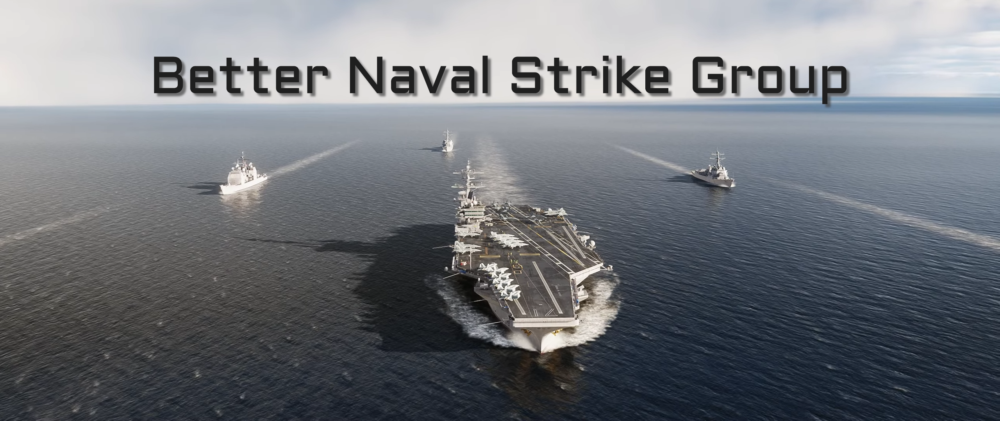

# Better Naval Strike Group (BNSG)

## What does BNSG do?
BNSG is a Mod for DCS that allows you to take control of the cruise missiles aboard your favorite destroyers and cruisers from the comfort of your ejection seat.

## Why did I create this?
I have felt that the Carrier Strike Groups (CSG) have always been a bit underwhelming in DCS. Especially, seeing how they are used in Multiplayer servers. The countless times, where I have launched off the deck only to be immediately engaged by an SA10 or SA05 on the coast. The CSG, rather than a strategic asset, are simply resorted to a runway on water. With this Mod, I can fly, determine a location of those SA05 and SA10 and fire a Tomahawk without putting a plane in danger.

## How do I use BNSG?
Using the communication menu...
1. Select "Naval Strike Group"
    * You should see a list of the available ships capable of launching cruise missiles
3. Select a ship from the list
4. Select `Check Status` to see the inventory and whether or not it is available for tasking
5. Using the F10 Map, place a marker with the prefix "nsgt" and a number for each target you would like to launch at. For example, `NSGT1`, `NSGT2`, `NSGT3`, etc
    * Default inventory is `22` cruise missiles
    * Default simultaneous launch capability is `10`
6. Select `Fire Cruise Missiles` to launch a Tomahawk at each of the markers you placed
    * A Time-To-Impact is provided to you every 10 seconds using the updated telemetry data of each missile in the air

## How do I add BNSG to my missions?
BNSG has no external dependencies (MOOSE, MIST) so you can simply
1. Add a `trigger` on `Mission Start`
2. Add an `action` to `Execute Script`
3. Paste the contents of `bnsg.lua` in the script box
    * Alernatively, you can `Execute Script from File` but you will need to save the `bnsg.lua` file locally

## FAQ
* Why are there no ships available on REDFOR?
    * Currently, no REDFOR ships are capable of firing cruise missiles
* You are aware you can do this with Combined Arms?
    * Yes I am aware...

## Download links
* You can get the [bnsg.lua](bnsg.lua) here

## Continue the conversation
Feel free to post any problems or suggestions on the [ED Forums](https://forum.dcs.world/topic/349094-introducing-flightdeck-a-simple-but-smart-launcher-for-dcs/)
  
## For nerds
This mod was 95% built using ChatGPT...
